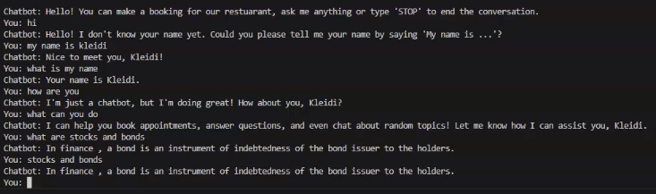

# Portfolio Repository

This repository is my portfolio hub. Each folder contains a separate project with its own code, assets, and documentation.

## Projects
- [Computer Vision](#computer-vision)
- [Game Project](#game-project)
- [Cafe Website](#cafe-website)
- [Graphics Project](#graphics-project)
- [Human-AI Interaction](#human-ai-interaction)
- [Mobile App](#mobile-app)

---

## Computer Vision
**Repository:** [Computer Vision](https://github.com/Klidster/Computer-Vision-Project.git)

**What it is:**  
Built a project using MATLAB which involves
using AI training methods for a model to be able to pick up patterns in thousands of
images and separate the images into specific classes

**Tech:** MATLAB

**Media:**  

---

## Game Project
**Repository:** [Game Project](https://github.com/Klidster/Game-Project.git)

**What it is:**  
Created a full comedic narrative driven 3D puzzle game in Unity, and I’m currently expanding and polishing it with the goal of releasing it
publicly.

**Tech:** Unity / C#

**Media:**  

---

## Cafe Website
**Repository:** [Cafe Website](https://github.com/Klidster/Cafe-Website.git)

**What it is:**  
Created a cafe website with responsive navigation, menu pages, image sections,
and a clean layout.

**Tech:** HTML/CSS/JavaScript

**Media:**  

---

## Graphics Project
**Repository:** [Graphics Project](https://github.com/Klidster/Graphics-Project.git)

**What it is:**  
Created a Computer Graphics project showcasing all of the fundamentals of OpenGL
graphics programming in C++.

**Tech:** OpenGL / C++

**Media:**  

---

## Human-AI Interaction
**Repository:** [Human-AI Interaction](https://github.com/Klidster/Human-AI-Interaction-Project.git)

**What it is:**  
Developed an AI chatbot using python which primarily handles bookings for a
restaurant but also could also respond to many different general inquiries and have
longer conversations with the user.

**Tech:** Python

**Media:**  

---

## Mobile App
**Repository:** [Mobile App](https://github.com/Klidster/Media-Player-Mobile-Application.git)

**What it is:**  
Developed a mobile application using Java which worked as a
user-friendly application to store songs, play them and skip through them similar to
other media players.

**Tech:** JavaScript / Android Studio
